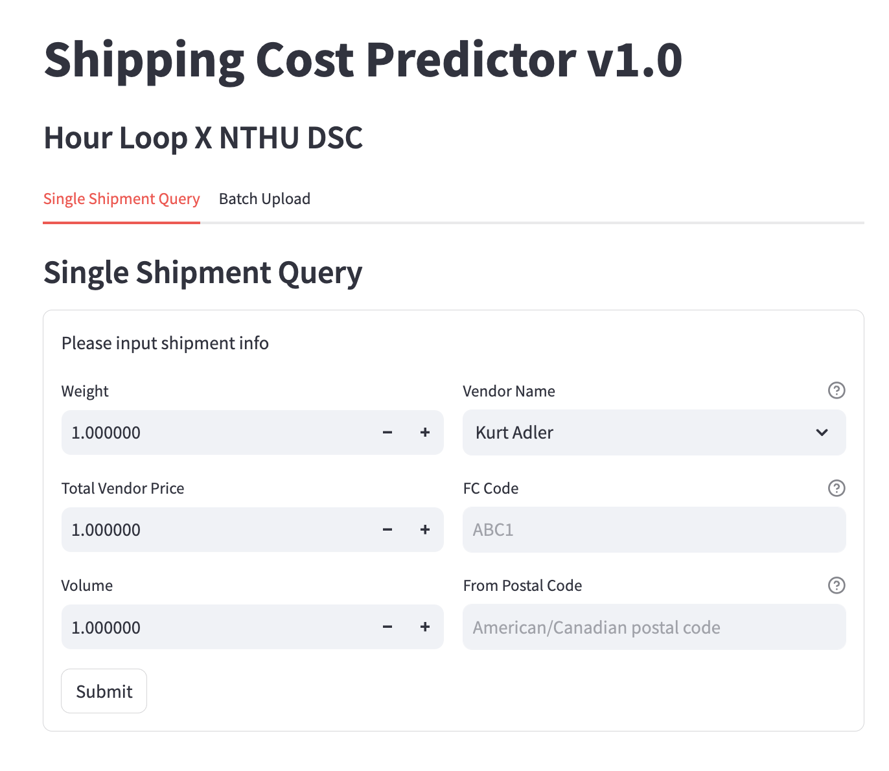

# Machine Learning Driven Shipping Cost Modelling and Decision Optimization

A machine learning system developed by **Hour Loop × NTHU DSC** to predict domestic U.S. shipping costs across various shipment methods using real order features.

## 🚚 Project Overview

The system supports both **single shipment input** and **batch CSV uploads**, returning predicted costs and ranked shipping methods. Each shipping method (ship_method) is trained with a dedicated model, and predictions are generated using an ensemble of top-performing models.

This repository contains a multi-model machine learning pipeline to predict shipping cost for different shipping methods in the US domestic logistics market. The models are tailored to each `ship_method`, improving forecasting accuracy and aiding operational decisions.

## 🎯 Goal
- Predict shipping cost using tabular order features
- Support multiple shipping methods (e.g., AMAZON_FREIGHT, UPS_PARCEL...)
- Provide ranked suggestions for lowest estimated cost


## 🚀 Quick Start

### ▶️ Run the App

```bash
cd HOURLOOP
streamlit run App/main.py
````

---

## 📂 Project Structure

```
HOURLOOP/
├── App/                    
│   ├── main.py              # Streamlit UI entry point
│   ├── utils/               # Core logic modules
│   │   ├── datapipeline.py      # Feature generation + encoding
│   │   ├── predict.py           # Final model prediction logic
│   │   ├── check_data.py        # Validation for inputs
│   │   ├── fc.csv, vendors.json # Location + vendor mappings
│   │   └── featuredata.json     # Feature configs per model
│   ├── encoders/            # Categorical encoders (pkl)
│   └── models/              # Model files by method + type
│       ├── SVR/, CatBoost/, FT-Transformer/...
│
├── Models/                  # Raw/backup model folders
├── reference_code/          # Jupyter Notebooks (training)
├── requirements.txt         # Dependency list
├── README.md
└── .gitignore
```

---

## 🧠 Model Overview

We trained a dedicated model for each `ship_method`, using:

* Linear Regression (OLS, Ridge, Lasso)
* **Bayesian Linear Regression**
* **Support Vector Regression (SVR)**
* **Random Forest**
* **CatBoost**
* **FT-Transformer**

Each model was tuned using grid search or Optuna and validated on hold-out time ranges.

### Feature Engineering Highlights

* `log_weight`, `log_volume`, `log_TVP/log_weight`, `log_distance`
* Target Encoding: `vendor_name`
* Frequency Encoding: `from_state`, `to_city`, `fc_code`
* Derived Features: `across_state`, distance metrics

---

## 💻 UI Features

### 🔹 Single Shipment Query

Fill in 6 required fields:

* Weight
* Total Vendor Price
* Volume
* Vendor Name
* FC Code (destination)
* From Postal Code

→ Predict shipping cost and ranking across all methods.

### 🔸 Batch Upload

Upload a CSV file with multiple shipments:

* Auto-validates format, data types, and missing values
* Returns downloadable predictions with ranked costs

---

## 📤 Output Format

| Shipment ID | ship\_method | predicted\_cost |
| ----------- | ------------ | --------------- |
| 0001        | AMAZON\_LTL  | 12.40           |
| 0001        | UBER\_LTL    | 14.80           |
| 0001        | ESTES        | 100.20          |

All results are downloadable as `.csv`.


## 📸 UI Preview



---

## ⚠️ Disclaimer

This project is intended for research and educational purposes.
All data used in this project is anonymized or internal to Hour Loop.


## 🤝 Credits

Developed by:
Dennis Pai, Howard Sun, Ellina Tsao, Hailey Chang, Jonathan Lee, Amity Wu

Hour Loop × National Tsing Hua University Data Science Club


## 📩 Contact

For inquiries or requests, contact:
📬 `nthu.dsc@gmail.com`
